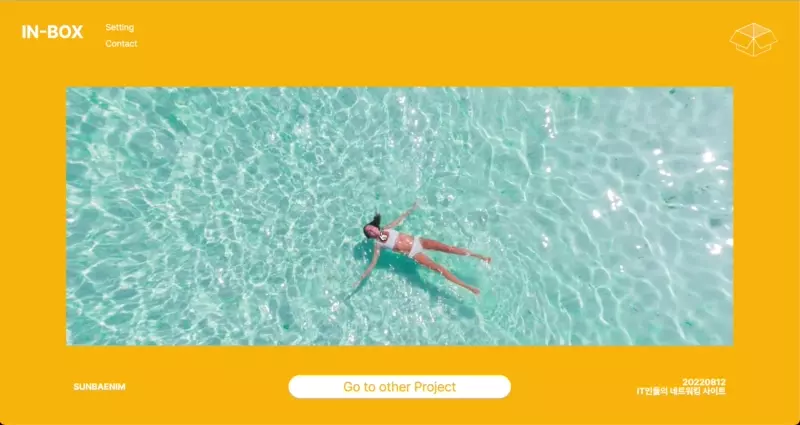
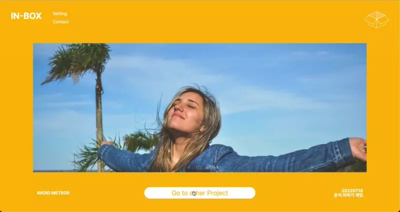

# IN-BOX Project
> 인박스 프로젝트의 프론트엔드 개발을 담당하였습니다.

## 실행
[Link](https://in-box.co.kr)

## 사용
- React
- Next.js
- TypeScript
- SCSS
- CSS module
- Recoil
- Amazon Lighthouse
- Amazon S3
- Google Analytics
- Google Search Console
- Hotjar

## 목차
- [기능](#기능)
- [구현](#구현)
- [트러블 슈팅](#트러블-슈팅)
- [학습한 내용](#학습한-내용)
- [보완점](#보완점)

---

## 기능

### 반응형
화면 사이즈 및 사용 기기 여부에 따라 웹사이트 크기 변화

### 포트폴리오 생성 기능
| 포트폴리오 생성               |
|----------------------------|
|  |

### Filter/Range 설정에 따른 포트폴리오 조회 기능
- `Filter` : 포트폴리오 영상 조회 시 영상을 덮는 썸네일에 대한 적용 여부 결정
- `Range` : FE(프론트엔드) 포트폴리오를 조회할 것인지, BE(백엔드) 포트폴리오를 조회할 것인지, 둘 다 조회할 것인지를 결정할 수 있는 옵션

| Filter 적용 시            | Filter 미적용 시          |
|-------------------------|-------------------------|
|  |  |

### 포트폴리오 썸네일 클릭 시 영상 조회 기능
Filter 설정이 On 상태여도, 썸네일을 클릭하면 바로 포폴 조회 가능
| Filter 이미지 클릭 시 영상 조회 기능 |
|-------------------------------|
|        |

### 포트폴리오 전환 및 애니메이션
| Fade-in and out 애니메이션      |
|-------------------------------|
|        |

---

## 구현

### 파일 및 폴더별 역할
__page/__

| 함수                 | 역할                            |
|---------------------|--------------------------------|
| home/`index`        | 메인 홈페이지                     |
| portfolios/`index`  | 포트폴리오 조회 페이지              |
| setting/`index`     | 포트폴리오 조회 옵션 및 업로드 페이지   |
| info/`index`        | 프로젝트 정보 소개 페이지            |

__components/UI__
| 함수                 | 역할                            |
|---------------------|--------------------------------|
| `FormBox`           | 메인 홈페이지의 박스 이미지          |
| `HeaderMenu`        | 헤더 메뉴의 텍스트 및 링크            |
| `HeaderBox`         | 헤더 메뉴의 박스 이미지               |
| `Header`            | 메뉴 컴포넌트를 모두 합친 부모 컴포넌트 |

__components/portfolio__
| 함수                 | 역할                            |
|---------------------|--------------------------------|
| `PortfolioContent`  | 포트폴리오 조회 및 전환 컴포넌트       |

__components/setting__
| 함수                 | 역할                            |
|---------------------|--------------------------------|
| `SettingList`       | 설정 페이지                       |
| `OnOffBtn`          | Filter On/Off 버튼              |
| `FeBeBtn`           | Range FE/BE 버튼                |

__components/upload__
| 함수                 | 역할                            |
|---------------------|--------------------------------|
| `Dropzone`          | 포트폴리오 업로드 컴포넌트            |
| `List`              | 업로드 폼의 항목 컴포넌트            |
| `RangeBtn`          | 업로드 폼의 항목 중 Range 버튼 컴포넌트|
| `ModalFormList`     | 업로드 폼의 항목을 모아둔 컴포넌트     |
| `ModalForm`         | 폼 전체 항목과 파일 업로드 컴포넌트를 합친 컴포넌트 |

__state/__
| 함수                 | 역할                            |
|---------------------|--------------------------------|
| `SelectedFilter`    | Filter 적용 여부를 판단하는 전역 상태 |

__scripts/__
| 함수                 | 역할                            |
|---------------------|--------------------------------|
| `generate-sitemap`  | 사이트맵 생성 함수                 |

__utils/__
| 함수                 | 역할                            |
|---------------------|--------------------------------|
| `fetchData`         | 백엔드 서버 fetch 모듈화           |
| `filters`           | Filter 이미지 배열                |


### 포트폴리오 생성
1. 포트폴리오 업로드 시 각 항목의 변화를 감지하도록 `useState` 훅 사용
2. 포트폴리오 파일 업로드의 로딩 숫자가 변함에 따라 전체 컴포넌트의 불필요한 리렌더링이 발생하여, 파일 업로드 컴포넌트와 일반 항목을 분리
3. 포트폴리오 파일은 업로드 가능한 파일에 한하여 S3 스토리지에 저장되며 저장된 파일 경로를 리턴값으로 받음
3. 모든 항목의 유효성 검사가 통과됨에 따라 submit 버튼 활성화, `useState` 훅을 사용하여 버튼 상태 추적
4. 유효성 검사가 통과된 모든 데이터를 객체화 하여 백엔드 서버에 POST 요청
5. 유저의 이메일로 보낸 확인 코드를 잘못 입력했을 경우, alert 메시지 발생
6. 성공적으로 업로드 된 경우 성공 알림과 함께 페이지 리로드

```
const formListData = {
    range: 유저가 올리는 포트폴리오의 분야(백엔드인지 프론트엔드인지),
    title: 포트폴리오 제목,
    date: 포트폴리오 날짜,
    about: 포트폴리오 설명,
    email: 유저의 이메일,
    confirmCode: 유저가 입력한 이메일로 보낸 유저 이메일 확인용 코드,
    confirmIdx: 유저가 입력한 이메일과 해당 이메일로 보낸 코드의 일치 여부를 판별하기 위한 인덱스 번호,
    filePath: 유저가 업로드한 파일이 저장된 S3 경로(보안을 위해 암호화 되어 있음),
  }
```

### Filter 설정에 따른 포트폴리오 조회
1. 부모 컴포넌트인 SettingList의 불필요한 리렌더링 방지를 위해 버튼 컴포넌트화
2. 상태값에 따라 포트폴리오 페이지에도 영향을 미치기 때문에 전역 상태로 관리하도록 설정
3. 페이지 첫 로딩 시 디폴트 옵션은 ON
4. 유저가 설정한 옵션을 계속 유지하기 위해 `로컬 스토리지`에 해당 정보 저장, `useEffect` 훅 사용하여 상태값 반영
5. 버튼 클릭 시 백엔드 서버로부터 쿠키를 발급 받아 포트폴리오 조회 시 헤더에 옵션 정보를 담은 쿠키 전달

```
// OFF 클릭 시 Response Headers
Set-Cookie: filter=off;
// Response Headers
Cookie: filter=off
```
```
// ON 클릭 시 Response Headers
Set-Cookie: filter=;
// Response Headers
Cookie 없음
```

### Range 설정에 따른 포트폴리오 조회
1. 위 Filter와 구현 방법이 비슷하나 컴포넌트를 분리한 이유: 두 컴포넌트의 로직이 다름(Filter는 양자택일이지만 Range는 동시 선택이 가능해야 함)

### 포트폴리오 썸네일 클릭 시 영상 조회 기능
1. `useState` 훅을 사용하여 이미지 노출 여부를 결정하는 상태 생성: `showImg`
2. 이미지 클릭 시 이벤트 핸들러 함수 `filterImgClickHandler` 작동, `showImg === false` 상태가 되어 컴포넌트 리렌더링, 이미지 사라지고 포트폴리오 영상 노출

### 포트폴리오 첫 접속 시 비디오 데이터 불러오기
1. Next.js에서 제공하는 `getStaticProps` 함수를 사용하여 data fetching 처리

### 포트폴리오 전환 및 애니메이션
1. CSS @keyframes를 사용하여 1초 동안 opacity 0에서 1로 변화하도록 설정

---

## 트러블 슈팅
- 지속적인 프론트 서버 다운 문제
- sitemap.xml 접속 시 404 에러
- next/image 로딩 속도
- 빌드 시 memory leak 문제
- 필터 이미지 전환 시 애니메이션 효과: 리렌더링이 일어나지 않기 때문에 애니메이션 효과가 일어나지 않은 것

---

## 학습한 내용
- 사용하는 리액트 훅의 동작 원리에 대해 명확히 파악하기
- Next.js를 사용한 이유?
- SSG vs SSR
- 상태 관리에 대한 개념 및 어떤 툴을 사용할 것인가?
- 타입스크립트는 왜 사용하는가?
- type vs interface
- git flow 적용
- 렌더링의 개념과 작동 방식
- sitemap 생성
- 기술 검토 시, 가장 기본부터 검토하는 것이 필요

## 보완점
- 리액트 훅의 다양한 사용
- 로딩 속도를 개선하기 위한 노력
- 초기 설계 시 컴포넌트를 분리할 때, 재사용성의 관점 + 데이터 흐름의 관점 모두 점검하고 분리하기
